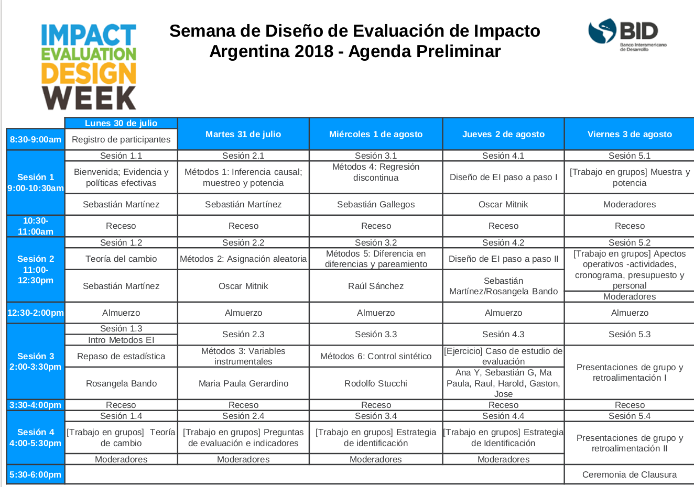
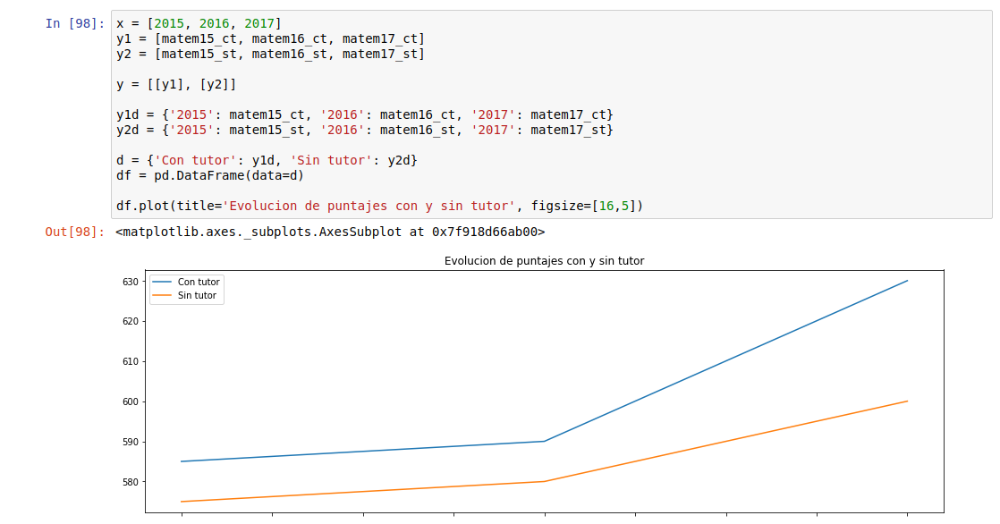

# SEMANA DE DISEÑO DE EVALUACIÓN DE IMPACTO 2018

Agenda

Ejercicios técnicos.  

## Sitios de referencia
www.iadb.org/portalevaluacion  
Página del taller: www.iadb.org/iedw  
Post: https://www.iadb.org/es/topics-effectiveness-improving-lives/semana-de-diseno-de-evaluacion-de-impacto-jul-ago-2018  

## Materiales del curso
[Presentaciones](http://www.iadb.org/document.cfm?id=EZSHARE-1350314980-283) o [copia acá](presentaciones-de-cada-materia/).  
[Material de trabajo](http://www.iadb.org/document.cfm?id=EZSHARE-1350314980-284) o [copia acá](trabajos-practicos-y-datos/).  

## Ejercicios Prácticos del curso
### Ejercicio 2.1 Inferencia Causal 

Dato a trabajar: [aquí](data/2.1 Datos_Inferencia_Causal.xlsx).  
EL formato no esta listo/cómodo para analizar por aquí lo pase a dos CSVs.  
[Éste](data/2.1_Datos_Inferencia_Causal-2013.csv) y [éste](data/2.1_Datos_Inferencia_Causal-2012.csv).  

Vamos a analizar si la intervención tuvo efecto entre el año 2012 y 2013.  

### Ejercicio 3.2

